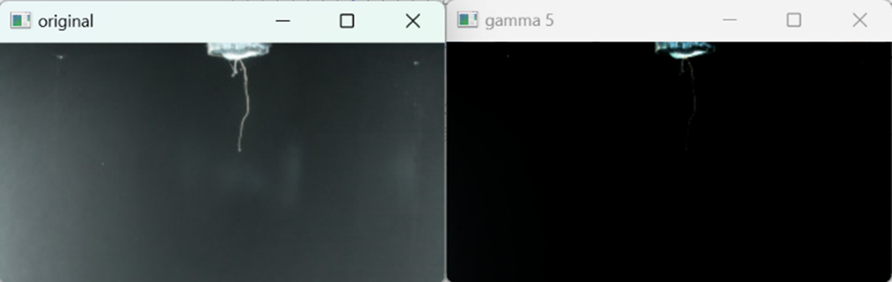
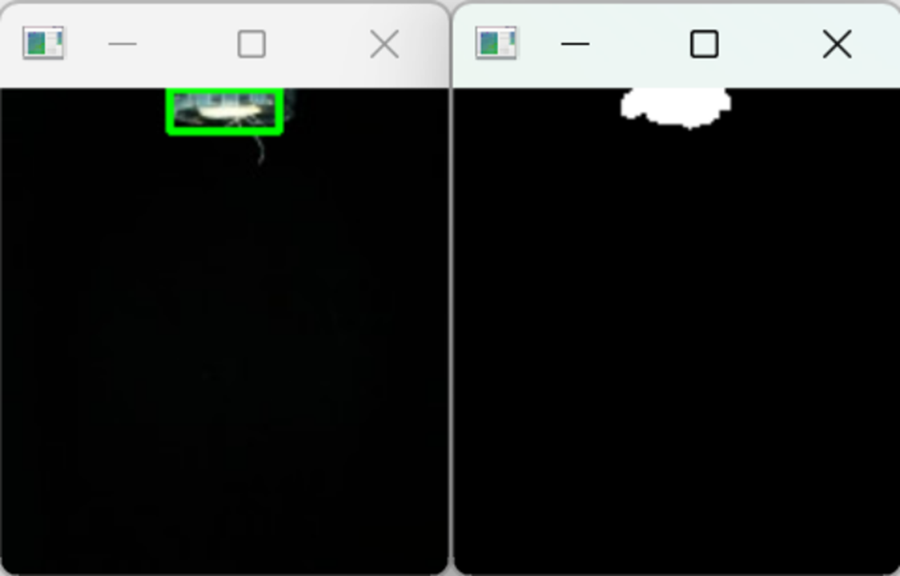
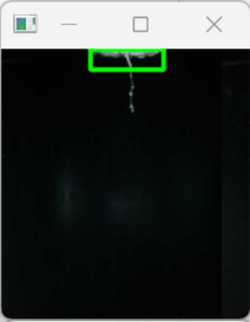
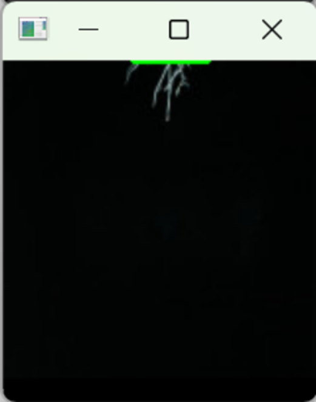
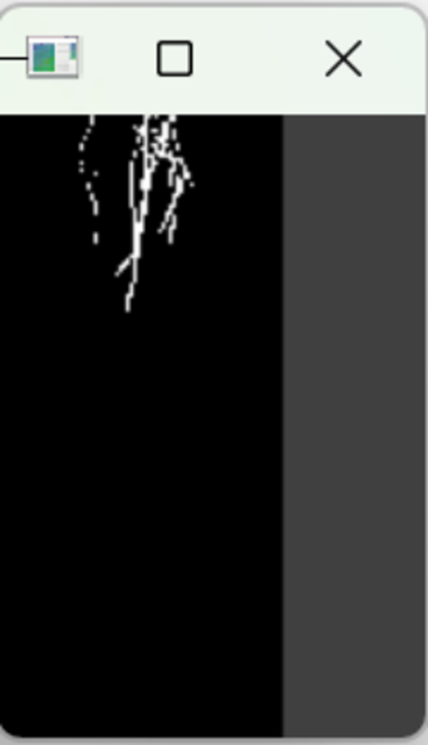
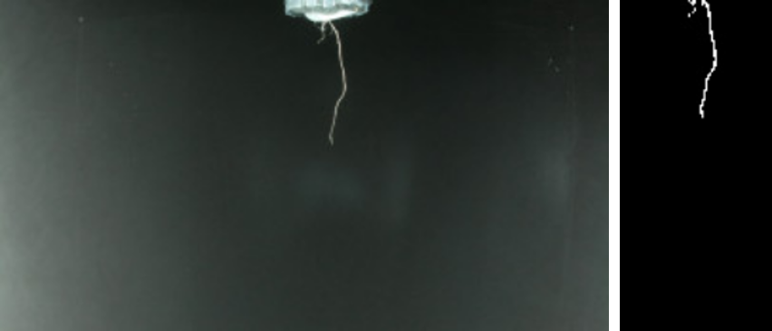
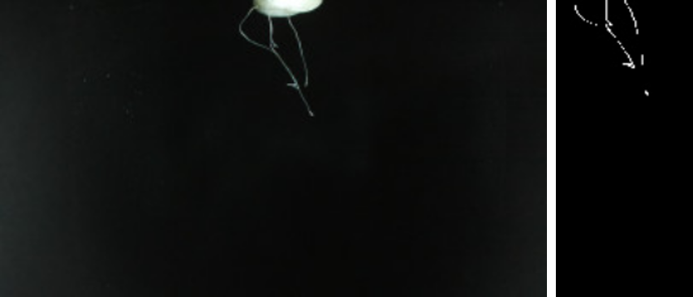
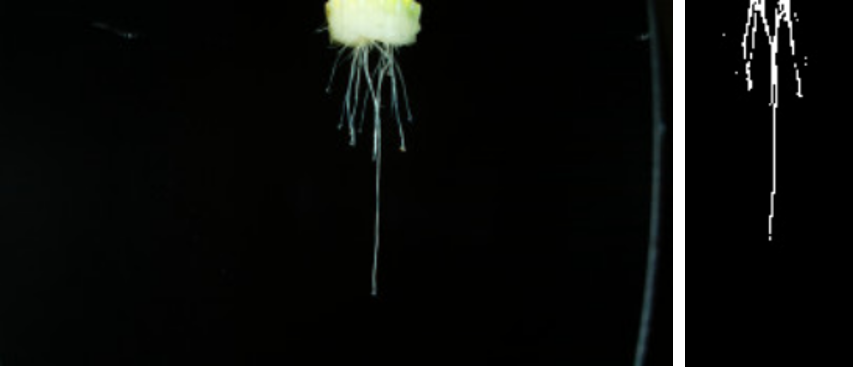

# 🌱 식물 생장 주기 분류 모델

**식물의 촬영 이미지를 분석하여, 생장이 시작된 후 12시간 단위로 시간이 얼마나 흘렀는지 분류하는 인공지능 모델**입니다. 본 프로젝트에서는 촬영 환경의 노이즈와 화분의 구조적인 특징을 제거하는 다양한 전처리 기법을 적용하여, 분류 정확도를 향상시켰습니다.

---

## 주요 기능

- 식물 촬영 이미지의 생장 시간(12시간 단위) 분류
- 다양한 이미지 전처리 기법 적용 (Gamma 보정, Thresholding 등)
- 화분 제거 및 중심 정렬을 통한 주요 특징 정렬
- Morphological Transformation을 통한 뿌리와 배경 분리

---

## 기술 스택

- Python 3.8+
- OpenCV
- NumPy
- Matplotlib

---

## 핵심 알고리즘

### 📷 이미지 전처리 과정

1. **Gamma 보정**

   

   - 뿌연 배경을 어둡게 만들어 주요 대상인 뿌리를 강조
   - 뿌리와 배경의 명도 대비를 증가시켜 정확한 식별 가능

2. **Cropping**

   

   - 뿌리가 존재하지 않는 양측 공간을 미리 제거하여 노이즈 감소
   - 전체 학습 데이터의 일관성 유지

3. **Image Blurring & Thresholding**

   

   - `5x5 Gaussian Blur`로 노이즈 제거
   - Binary Threshold를 통해 이미지를 흑/백으로 이진화


4. **Bounding Rectangle Detection**

   

   - 화분의 흰색 픽셀을 기준으로 바운딩 박스를 탐색
   - 정렬 기준이 되는 화분의 위치 좌표 획득


5. **X축 중앙 정렬**

   

   - bounding box 좌표(x, y, w, h)를 기준으로 식물의 뿌리가 이미지 중앙으로 오도록 이동
   - 모든 이미지의 기준점을 통일하여 학습 효과 증대


6. **Morphological Transformation 기반 화분 제거**

   

   - Opening 연산을 통해 수직 방향의 뿌리 구조 제거
   - 화분 하단 영역을 제거하여 순수 뿌리 영역만 남김


7. **추가 Cropping**

   

   - 불필요한 양옆 여백을 추가적으로 잘라내어 입력 이미지 정제


---

## 성능 평가

- **Test Accuracy**: `0.5084`
- **Loss**: `5.95`

> Accuracy는 전체 예측 중 올바르게 분류된 샘플의 비율로, 클래스 불균형이 없을 때 유용한 지표입니다. 하지만 실제 문제에서는 다양한 클래스 간 중요도 차이가 존재하므로 향후 precision/recall 등의 보조 지표 도입 필요성이 있습니다.

---

## 결과 예시




---

## 프로젝트 구조

```
.
├── preprocessing/          # 전처리 스크립트
│   └── process.py
├── model/                  # 학습 및 추론 코드
│   ├── train.py
│   └── infer.py
├── dataset/                # 원본 및 전처리 이미지
├── example/                # 결과 시각화 예시
├── notebook/               # 분석 노트북
└── README.md
```

---

## 설치 및 실행

```bash
# 1. 환경 설치
pip install -r requirements.txt

# 2. 이미지 전처리
python preprocessing/process.py --input_dir dataset/raw --output_dir dataset/processed

# 3. 모델 학습
python model/train.py

# 4. 추론 실행
python model/infer.py --image example/input1.png
```

---

## 산학협력 성과

- 실제 식물 생장 환경에서 촬영된 이미지 데이터셋 확보
- 화분 구조 및 촬영 방향의 정규화를 통해 **AI 학습 효과 향상**
- 향후 **센서 기반 식물 성장 모니터링 시스템과의 연계 가능성 확인**

---

## 참고 문헌

1. Otsu, N. (1979). *A Threshold Selection Method from Gray-Level Histograms*.
2. Gonzalez, R. C., & Woods, R. E. (2002). *Digital Image Processing*.
3. Simonyan, K., & Zisserman, A. (2014). *Very Deep Convolutional Networks for Large-Scale Image Recognition*.

---

## 프로젝트를 통해 배운 점

- **좋은 데이터 전처리 없이 좋은 모델은 없다**는 교훈
- AI 모델 학습보다 더 중요한 **데이터 수집과 정제 과정의 경험**
- 어떤 데이터를 어떻게 다듬고 어떤 특징을 반영할지에 대한 **방향 설정 능력** 향상
